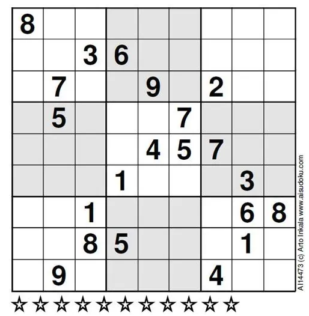

# Sudoku-Go

## What is this?

This is a program made by Golang that automatically solves Sudoku answers.

## Demo

Let the following problems be solved.



This problem is said to be the most difficult Sudoku problem in the world.


## Usage

```cmd
# Clone this repository.
git clone https://github.com/takutakuaoao/Sudoku-Go.git

# Make docker environment and enter there.
cd Sudoku-Go/docker
docker-compose up

docker exec -it sudoku-go bash
cd ./app

# Go build and run
go install
go build
./Sudoku-Go
../example/question.txt
```

↓result↓

```cmd
Question...
=====================
[8 0 0 0 0 0 0 0 0]
[0 0 3 6 0 0 0 0 0]
[0 7 0 0 9 0 2 0 0]
[0 5 0 0 0 7 0 0 0]
[0 0 0 0 4 5 7 0 0]
[0 0 0 1 0 0 0 3 0]
[0 0 1 0 0 0 0 6 8]
[0 0 8 5 0 0 0 1 0]
[0 9 0 0 0 0 4 0 0]

Answer:)
=====================
[8 1 2 7 5 3 6 4 9]
[9 4 3 6 8 2 1 7 5]
[6 7 5 4 9 1 2 8 3]
[1 5 4 2 3 7 8 9 6]
[3 6 9 8 4 5 7 2 1]
[2 8 7 1 6 9 5 3 4]
[5 2 1 9 7 4 3 6 8]
[4 3 8 5 2 6 9 1 7]
[7 9 6 3 1 8 4 5 2]

process time: 186.0975ms
```

## Issues

We have obviously not tested this on every website. If you run into an issue, or find a way the automatic detection could be better, please [create an Issue](https://github.com/takutakuaoao/Sudoku-Go/issues/new). If you can include a test case, that's even better.
